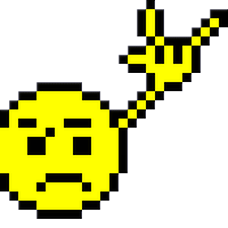

# Hi &nbsp;

- 📖 Graduando em  **Análise e desenvolvimento de sistemas**(UNISA - Universidade de Santo Amaro)
- 🌱 Atualmente estou aprendendo **HTML, CSS e JavaScript**
- ⚡ Curiosidades: Headbanger, Geek

---

  
  

 

  
  
  

 

  
    
    
  

<!--
**CleilsonAndrade/CleilsonAndrade** is a ✨ _special_ ✨ repository because its `README.md` (this file) appears on your GitHub profile.

Here are some ideas to get you started:

- 🔭 I’m currently working on ...
- 🌱 I’m currently learning ...
- 👯 I’m looking to collaborate on ...
- 🤔 I’m looking for help with ...
- 💬 Ask me about ...
- 📫 How to reach me: ...
- 😄 Pronouns: ...
- ⚡ Fun fact: ...
-->
