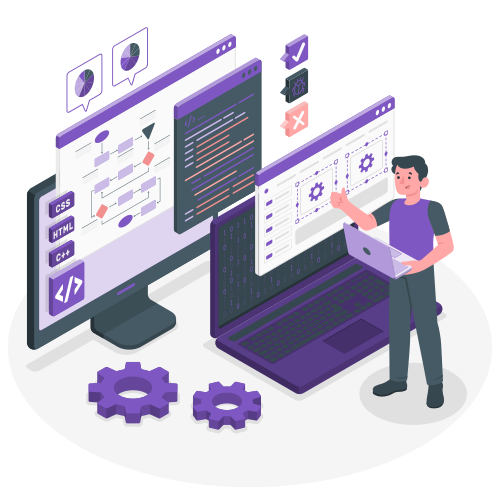

# &#x1F4BB; &#x1f918;

- 📃 Desenvolvedor Backend com histórico de participação em projetos como: TMS (Sistema de Gerenciamento de Transporte), Sistema de Roteirização
- 🎓 Graduado em **Análise e Desenvolvimento de Sistemas**
- ⚡ Curiosidades: Headbanger, Geek, Amante de carros

---

 

    

